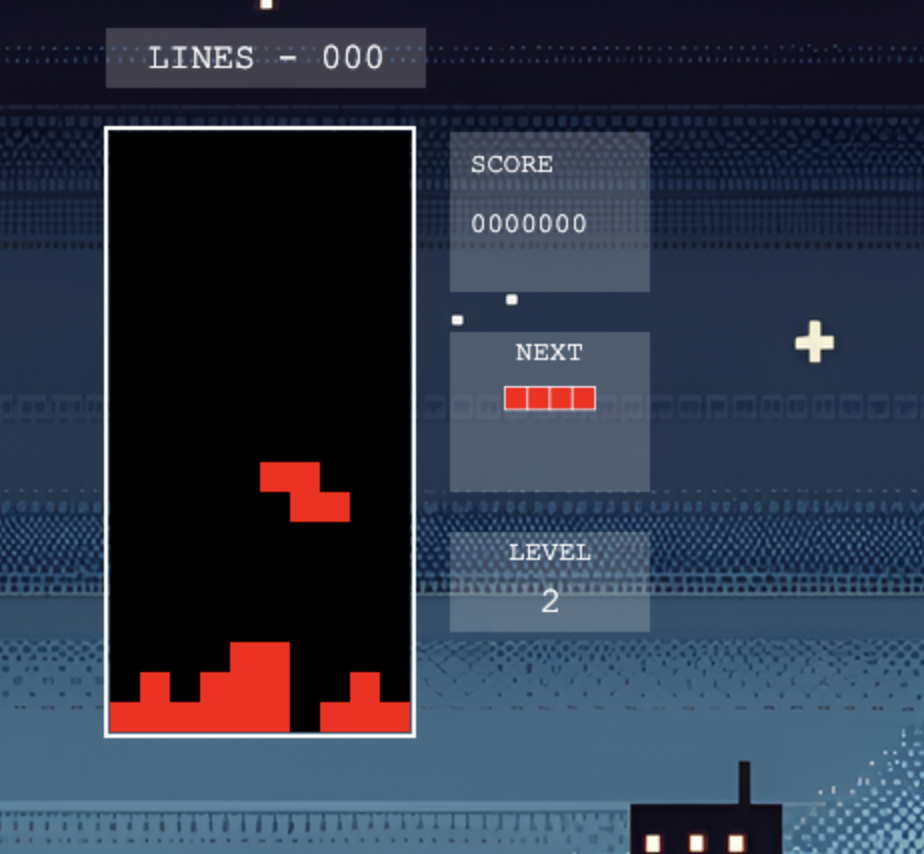

# Tetris Game



Welcome to Tetris Game! This is a classic implementation of the popular puzzle game Tetris, built using Phaser 3 and JavaScript.

## Game Features

- Classic Tetris gameplay mechanics
- Multiple levels with increasing difficulty
- Responsive game board and UI elements
- Smooth tetromino movement and rotation
- Next piece preview
- Score tracking and level progression
- Pause functionality
- Game over screen with restart option

## Play the Game

You can play the Tetris game online by visiting the following link:

[Play Tetris Game](https://isavita.github.io/tetris/)

## How to Play

- Use the left and right arrow keys to move the falling tetromino horizontally
- Press the up arrow key to rotate the tetromino clockwise
- Press the down arrow key to soft drop the tetromino (move it down faster)
- Press the spacebar to hard drop the tetromino (instantly drop it to the bottom)
- Press the 'P' key to pause or resume the game

## Installation

If you want to run the game locally, follow these steps:

1. Clone the repository:

```shell
git clone https://github.com/isavita/tetris.git
```

2. Navigate to the project directory:
```shell
cd tetris
```

3. Open the `index.html` file in your web browser.

## Technologies Used

- Phaser 3: A powerful 2D game framework for building HTML5 games
- JavaScript: The programming language used to develop the game logic
- HTML5: The markup language for structuring the game's web page
- CSS: The stylesheet language for styling the game's user interface

## Folder Structure

- `assets/`: Contains the game assets such as images and fonts
- `src/`: Contains the source code files for the game
- `GameEngine.js`: Implements the core game logic and mechanics
- `GameScene.js`: Handles the game scene, rendering, and user input
- `LevelSelectionScene.js`: Handles the level selection screen
- `index.html`: The main HTML file that loads the game

## Credits

- Tetris game concept and design by Alexey Pajitnov
- Game development and implementation by Claude Opus

## License

This project is licensed under the [MIT License](LICENSE).

## Acknowledgements

- Phaser 3 framework: [Phaser](https://phaser.io/)
- Tetris game inspiration and rules: [Tetris Wiki](https://tetris.fandom.com/wiki/Tetris_Wiki)

Feel free to customize and enhance the `README.md` file based on your specific project details, additional features, or any other relevant information you want to include.
